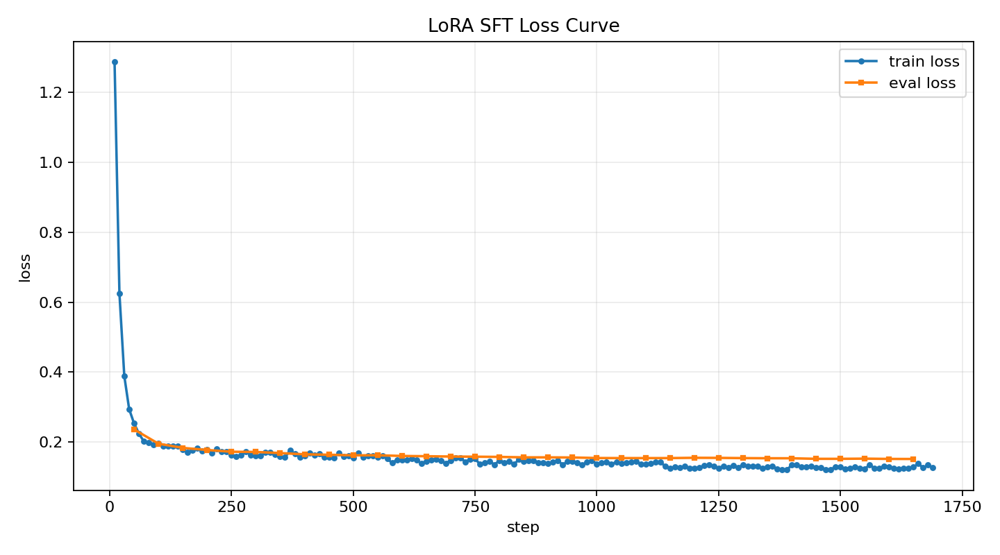

# 金融量化因子代码生成 LoRA 微调项目

本项目基于 `Qwen3-4B-Instruct-2507` 构建金融量化因子代码生成模型。模型输入为因子自然语言描述和 LaTeX 公式，输出符合约束的 Pandas 因子函数：

```python
def factor(df: pd.DataFrame) -> pd.Series:
    ...
```

项目提供本地/云端 LoRA 微调代码流程、训练配置、样例数据、loss 曲线可视化，以及 base/LoRA/DeepSeek-R1 API 三方对比评估记录，重点展示训练管线和实验方法。

## 项目定位

核心目标是验证：

> 通过 LoRA SFT，将金融量化因子代码生成任务中的输出协议和领域代码风格固化到小模型中，使模型在轻量 prompt 下更稳定地产出可执行的 `factor(df) -> pd.Series` 代码。

本项目的结论是：微调提升了小模型在特定任务接口、输出格式和工程可用性上的稳定性，降低了对长 prompt 约束的依赖。

## 为什么要微调量化因子代码生成模型

通用大模型具备较强的代码生成能力，但在金融量化因子生成任务中，经常出现以下问题：

1. 输出格式不稳定：模型可能输出长解释、不同函数名、不同入参，难以直接接入自动执行和回测流程。
2. 领域算子习惯不统一：量化因子常用 `rolling`、`shift`、`rank`、`groupby("date")` 等模式，通用模型不一定稳定采用项目需要的实现风格。
3. Prompt 依赖较强：如果不使用很长的格式约束，基座模型容易自由发挥，导致生成代码不能直接执行。
4. 推理成本较高：对于固定格式的垂直任务，如果小模型微调后能够稳定完成，部署成本会低于频繁调用更大的通用模型。

因此，本项目使用 LoRA 对 Qwen3-4B 进行 SFT，使模型学习项目数据中的金融因子代码生成协议，包括固定函数签名、Pandas/Numpy 实现方式、横截面排名写法和边界处理习惯。

## 项目亮点

- 使用 9,524 条金融量化因子代码样本构建 SFT 数据集，按 95/5 划分为 train/validation。
- 基于 `Transformers + PEFT` 对 `Qwen3-4B-Instruct-2507` 进行普通 LoRA 微调。
- 在 RTX 4090 24GB 上完成 3 epoch 训练，最终 train loss 收敛至 0.1588。
- 构建自动评估器，从语法、函数签名、依赖导入、代码执行、返回值类型和数值有效性评估生成代码。
- 对比 `Qwen3-4B Base`、`Qwen3-4B + LoRA` 和 `DeepSeek-R1 API` 在轻量 prompt 下的输出差异。

## 方法流程

```text
原始 instruction/input/output 样本
-> user/assistant messages
-> tokenizer.apply_chat_template
-> prompt token label = -100
-> assistant code token 参与 loss
-> Qwen3-4B-Instruct + LoRA
-> 生成 factor(df) 因子代码
-> 自动评估语法、签名、执行稳定性
```

本项目主线实现采用标准 `Transformers + PEFT`，方便在本地或租用 GPU 上复现训练、推理和评估流程。

## 数据质量分析

原始数据包含 9,524 条 `instruction / input / output` 格式样本，主要由因子描述、LaTeX 公式和对应 Pandas 代码组成。

当前项目将数据转换为 chat SFT 格式，并按 95/5 划分：

| Split | Samples |
|---|---:|
| Train | 9,047 |
| Validation | 477 |

参考答案代码的基础质量通过自动评估器检查。当前已对前 500 条参考输出进行评估：

| 指标 | 结果 |
|---|---:|
| syntax_pass_rate | 100.00% |
| signature_pass_rate | 100.00% |
| execution_pass_rate | 98.40% |
| series_return_rate | 98.40% |
| finite_value_rate | 98.40% |

这些指标说明：项目数据中的参考代码大多具备统一接口和可执行性，适合作为 SFT 数据基础。

## 训练超参数设定及理由

| 参数 | 设置 | 理由 |
|---|---:|---|
| Base model | `Qwen3-4B-Instruct-2507` | 中文理解和代码能力较强，4B 规模适合单卡 4090 微调 |
| Training method | LoRA SFT | 只训练增量 adapter，显存占用低，便于部署 |
| LoRA rank | 32 | 在表达能力和显存占用之间折中 |
| LoRA alpha | 64 | 通常设为 rank 的 2 倍，增强 LoRA 更新幅度 |
| LoRA dropout | 0.05 | 降低小数据集过拟合风险 |
| Learning rate | 1e-4 | LoRA SFT 常用学习率，训练稳定 |
| Epochs | 3 | 在训练充分性和过拟合风险之间折中 |
| Effective batch size | 16 | 通过 `per_device_train_batch_size=1` 和 `gradient_accumulation_steps=16` 实现 |
| Max length | 0 | 不主动截断，尽量保持样本完整性 |
| Precision | fp16 | 降低显存占用，适配 RTX 4090 |
| Gradient checkpointing | true | 牺牲部分速度换取更低显存 |

训练配置见：

```text
configs/lora_qwen3_4b.yaml
```

## 训练结果

| 指标 | 结果 |
|---|---:|
| train loss | 0.1588 |
| train runtime | 11100.98s，约 3.08 小时 |
| train samples/s | 2.445 |
| train steps/s | 0.153 |
| GPU | RTX 4090 24GB |

Loss 曲线：



## LoRA 权重

为了便于推理复现，训练后的 LoRA adapter 已发布至 Hugging Face：

- [Q-Sophia/qwen3-4b-quant-lora](https://huggingface.co/Q-Sophia/qwen3-4b-quant-lora)

该仓库只包含 PEFT LoRA adapter，不包含完整基座模型。推理时仍需加载 `Qwen/Qwen3-4B-Instruct-2507` 作为 base model。

## 评估设计

当前自动评估器主要检查生成代码的工程可接入性，而不是完整的金融语义准确率：

| 指标 | 含义 |
|---|---|
| `syntax_pass_rate` | 生成代码能否通过 Python AST 语法解析 |
| `signature_pass_rate` | 是否定义了 `factor(df)` 函数 |
| `pandas_import_rate` | 是否导入 `pandas` |
| `numpy_import_rate` | 是否导入 `numpy` |
| `execution_pass_rate` | 是否能在 mock 行情数据上执行 |
| `series_return_rate` | 是否返回 `pd.Series` |
| `finite_value_rate` | 返回值是否避免 `inf` 等异常数值 |

这些指标可以说明生成代码是否满足项目接口、是否能被自动执行流程调用，但不能单独证明因子逻辑完全正确。更严格的“代码准确率”需要为独立评测集构建 `reference_code`，再比较生成代码与参考实现的输出相关性或逐样本一致性。

评估器代码见：

```text
src/quant_codegen/evaluator.py
```

## 输出对比观察

在轻量 prompt 下，对比 `Qwen3-4B Base`、`Qwen3-4B + LoRA` 和 `DeepSeek-R1 API` 的输出，可以观察到：

- `Qwen3-4B Base` 倾向于输出解释性长文本和非统一函数签名，难以直接接入自动执行流程。
- `DeepSeek-R1 API` 生成的代码语法通常较完整，但更倾向于自由设计函数接口，不一定遵循本项目要求的 `factor(df) -> pd.Series`。
- `Qwen3-4B + LoRA` 在轻量 prompt 下更稳定地输出短代码块，并收敛到项目要求的 `factor(df) -> pd.Series` 格式。


本项目的主要结论是：

> LoRA 微调可以将金融因子代码生成任务中的输出协议固化到小模型中，使其在轻量 prompt 下更稳定地产出 `factor(df) -> pd.Series` 格式代码，降低对长 prompt 约束的依赖，并提升工程可用性。

## 示例对比

输入为因子描述和公式：

```text
基础洞察：过去5日涨幅较大的股票，短期可能延续动量。
因子详细描述：计算收盘价相对于5天前收盘价的涨跌幅，然后对该涨跌幅进行全市场横截面排名。
量化因子公式：rank((close - delay(close, 5)) / delay(close, 5))
```

基座模型输出节选：

```text
当然可以。以下是根据你提供的 Latex 公式和因子描述，撰写的符合量化因子逻辑的 Python 函数，
适用于在 pandas、vectorbt 或 backtrader 等量化框架中使用。

---

### Python 函数：calculate_momentum_rank_factor

```python
def calculate_momentum_rank_factor(close: pd.Series, window: int = 5) -> pd.Series:
    ...
###使用说明与注意事项

1. 输入要求：close 必须是 pd.Series，索引为日期。
2. 输出解释：值越大，表示该股票过去5日涨幅越大。
3. 边界处理：若5天前价格为0，则涨跌幅为 NaN。
    
```


基座模型能够理解任务并生成相关代码，但输出包含大量解释文本，且函数签名为自定义的 `calculate_momentum_rank_factor(...)`，不符合本项目自动执行流程要求的 `factor(df)` 接口。

LoRA 微调模型输出：

```python
import pandas as pd
import numpy as np

def factor(df: pd.DataFrame) -> pd.Series:
    delay_close_5 = df['close'].shift(5)
    diff_close = df['close'] - delay_close_5
    ratio = diff_close / delay_close_5.clip(lower=1e-6)
    df['_temp_ratio'] = ratio
    factor_series = df.groupby('date')['_temp_ratio'].rank(pct=True, method='first')
    df.drop('_temp_ratio', axis=1, inplace=True)
    return factor_series
```

## 项目结构

```text
quant/
  configs/
    lora_qwen3_4b.yaml
  data/
    sample_quant_code.json
  examples/
    eval_cases.jsonl
    prompt.txt
  results/
    loss_curve.png
    base_lora_deepseek_light.json
  scripts/
    prepare_sft_dataset.py
    train_lora_local.py
    generate_with_lora.py
    compare_base_lora.py
    compare_base_lora_deepseek.py
    evaluate_deepseek_api.py
    plot_loss_curve.py
  src/
    quant_codegen/
      dataset.py
      evaluator.py
      mock_data.py
      quality.py
  requirements.txt
  requirements-train.txt
```

## 使用方式

基础环境：

```bash
pip install -r requirements.txt
```

使用已发布的 LoRA adapter 进行推理，需要安装训练/推理依赖：

```bash
pip install -r requirements-train.txt

python scripts/generate_with_lora.py \
  --base-model Qwen/Qwen3-4B-Instruct-2507 \
  --adapter Q-Sophia/qwen3-4b-quant-lora \
  --prompt-file examples/prompt.txt
```

仓库默认提供样例数据和实验记录。若需要重新训练，请准备同格式 SFT 数据，并保存为 `data/quant_code.json`，再生成训练/验证集：

```bash
python scripts/prepare_sft_dataset.py
```

训练 LoRA 需要本地或云端 GPU 环境，以及可访问的 `Qwen3-4B-Instruct-2507` 基座模型：

```bash
pip install -r requirements-train.txt

python scripts/train_lora_local.py \
  --config configs/lora_qwen3_4b.yaml \
  --model-name-or-path /path/to/Qwen3-4B-Instruct-2507
```

训练完成后，可以根据输出目录中的 `log_history.json` 生成 loss 曲线：

```bash
python scripts/plot_loss_curve.py \
  --input outputs/qwen3-4b-quant-lora/log_history.json \
  --output results/loss_curve.png
```

如需重新运行三方对比评估，需要准备基座模型、LoRA adapter 和 DeepSeek API key：

```bash
python scripts/compare_base_lora_deepseek.py \
  --base-model Qwen/Qwen3-4B-Instruct-2507 \
  --adapter Q-Sophia/qwen3-4b-quant-lora \
  --deepseek-model deepseek-reasoner \
  --eval-cases examples/eval_cases.jsonl \
  --output results/base_lora_deepseek_light.json
```

使用 DeepSeek API 时，需要设置环境变量：

```bash
export DEEPSEEK_API_KEY=your_api_key
```

不要将 API key 写入代码或提交到 GitHub。

## 后续工作

- 构建 30-50 条独立结构化 eval set，覆盖动量、波动率、成交量、价量复合、区间突破等因子类型。
- 为每条 eval case 增加 `reference_code`，引入生成代码与参考实现的相关性评估。
- 探索 vLLM/Ollama 等部署方式，将 LoRA 模型封装为可调用服务。
- 在 SFT 基础上探索 GRPO/RLHF，将代码执行结果作为 reward 信号进一步优化。
