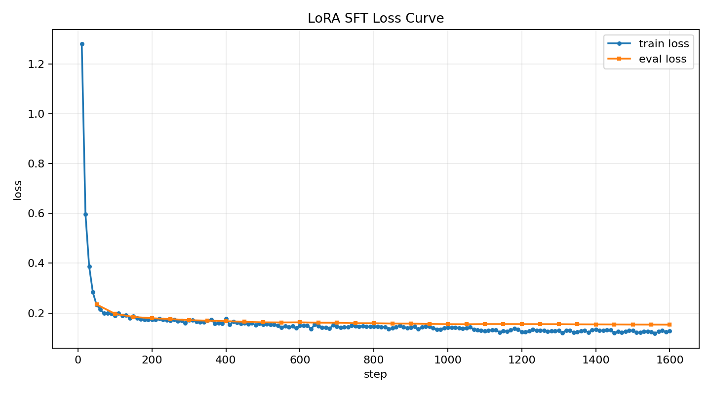

# 金融量化因子代码生成 LoRA 微调项目

本项目基于 `Qwen3-4B-Instruct-2507` 构建金融量化因子代码生成模型。模型输入为因子自然语言描述和 LaTeX 公式，输出对应可执行的 Python/Pandas 因子代码。

项目目标：

> 通过 LoRA SFT，将金融量化因子代码生成任务中的输出协议和领域代码风格固化到小模型中，使模型在轻量 prompt 下更稳定地把自然语言因子描述和 LaTeX 公式稳定转换为可执行 Python 因子代码。

## 项目亮点

- 使用 9,523 条规则化金融因子代码样本构建 SFT 数据集，按 90/5/5 划分为 train/validation/test
- 基于 `Transformers + PEFT` 对 `Qwen3-4B-Instruct-2507` 进行 LoRA 微调。
- 在 RTX 4090 24GB 上完成 3 epoch 训练，最终 train loss 收敛至 0.1595。
- 构建基于 reference code 执行结果的测试集评测管线，不比较代码文本，而比较生成代码的运行结果是否与参考实现一致。
- 在可验证 held-out 自动评测集上，LoRA 模型生成的代码达到 100.00% 可执行率和 98.52% 可执行功能准确率。
- 对比 Qwen3-4B Base、Qwen3-4B + LoRA 和 DeepSeek-V4 API 在轻量 prompt 下的输出差异。

## 任务定义

输入由两部分组成：

```text
1. 因子洞察 / 因子描述
2. LaTeX 形式的因子公式
```

输出为 Python/Pandas 因子代码。训练数据中的目标代码通常采用如下风格：

```python
import pandas as pd
import numpy as np

def factor(df: pd.DataFrame) -> pd.Series:
    ...
```

在最终功能评测中，不强制生成函数必须命名为 `factor`。只要模型输出中存在可调用函数，能够接收项目使用的长表行情 `DataFrame`，并返回可比较的因子结果，就会进入执行结果一致性检查。

## 为什么需要微调

通用大模型具备代码生成能力，但在金融因子代码生成任务中，经常存在以下问题：

1. 输出接口不稳定：可能生成解释性长文本、自定义函数名、不同入参或不同数据格式。
2. 领域实现习惯不统一：例如 `rolling`、`shift`、`rank`、`scale`、除零保护等边界规则可能与项目规范不一致。
3. 对 prompt 依赖强：需要较长的格式约束才能稳定输出可执行代码。
4. 部署成本较高：固定垂直任务如果可由小模型完成，推理和部署成本更低。

LoRA 微调的价值在于让模型学习数据集中的领域代码风格、算子实现规则和边界处理习惯，使其在轻量输入下也能输出更贴合项目执行流程的代码。

## 数据集与划分

原始数据为 `instruction / input / output` 格式样本，每条样本包含：

- `instruction`：量化因子代码生成任务指令；
- `input`：因子洞察、因子描述和 LaTeX 公式；
- `output`：对应的 Python/Pandas 因子实现。

本项目使用随机种子 `42` 进行 `90/5/5` 划分，并对测试集 reference code 做自动执行审计。最终用于训练、验证和报告的样本规模如下：

| Split | Samples | Approx. Ratio | 
|---|--------:|--------------:|
| Train |   8,571 |         90.0% |
| Validation |     476 |          5.0% | 
| Test |     476 |          5.0% |

GitHub 仓库只保留小规模样例数据，完整训练数据不随仓库发布。

## 方法流程

```text
原始 instruction/input/output 样本
-> 转换为 user/assistant messages
-> tokenizer.apply_chat_template
-> 仅 assistant code 部分参与 loss
-> Qwen3-4B-Instruct + LoRA SFT
-> 生成 Python 因子代码
-> 在 held-out test set 上执行生成代码
-> 与 reference code 执行结果比较
```

## 训练配置

| 参数 | 设置 | 理由 |
|---|---:|---|
| Base model | `Qwen3-4B-Instruct-2507` | 中文理解和代码生成能力较强，4B 规模适合单卡 RTX 4090 做 LoRA 微调。 |
| Training method | LoRA SFT | 只训练增量 adapter，显存占用低，训练和后续部署成本都低于全量微调。 |
| LoRA rank | 32 | 在表达能力和显存占用之间折中，足够学习固定任务中的代码风格和接口规范。 |
| LoRA alpha | 64 | 设为 rank 的 2 倍，用于增强 LoRA 更新幅度，是常见稳定配置。 |
| LoRA dropout | 0.05 | 为小规模垂直数据集加入轻微正则，降低过拟合风险。 |
| Learning rate | 1e-4 | LoRA SFT 常用学习率，训练收敛较快且在本任务上稳定。 |
| Epochs | 3 | 在充分学习输出协议和避免过拟合之间折中；训练后 train/eval loss 均已收敛到较低水平。 |
| Per-device batch size | 1 | 适配 24GB 显存，避免单步显存溢出。 |
| Gradient accumulation steps | 16 | 通过梯度累积获得等效 batch size 16，提高训练稳定性。 |
| Effective batch size | 16 | 与数据规模和 4090 显存约束匹配。 |
| Precision | fp16 | 降低显存占用并提升训练速度，适配消费级 GPU。 |
| Gradient checkpointing | true | 牺牲部分速度换取更低显存占用，使 4B 模型能在 4090 上完成训练。 |
| Max length | 不主动截断 | 保留完整训练样本，避免代码或公式被截断影响监督信号。 |
| GPU | RTX 4090 24GB | 验证该项目可以在单张消费级高端显卡上完成 LoRA SFT。 |

配置文件：

```text
configs/lora_qwen3_4b.yaml
```

## 训练结果

本 README 中的训练和测试结果对应 v2 LoRA 权重。

| 指标 | 结果 |
|---|---:|
| Epoch | 3.0 |
| Train loss | 0.1595 |
| Final eval loss | 0.1535 |
| Train runtime | 10800.67s，约 3.00 小时 |
| Train samples/s | 2.381 |
| Train steps/s | 0.149 |
| GPU | RTX 4090 24GB |

Loss 曲线：



## 评测方法

评测目标是判断生成代码是否真正完成了测试集 reference 所定义的因子实现，而不是比较代码文本是否相同。

评测流程：

1. 对 test set 中的 reference code 做执行审计，确认其能在固定 mock 行情数据上产生可比较结果。
2. 使用通过审计的样本构建自动执行评测集。
3. 对 LoRA 模型生成的代码提取 Python 函数。
4. 在同一组 mock 行情数据上执行生成函数。
5. 将生成结果与 reference code 的执行结果进行数值一致性比较。

主指标：

```text
Executable Functional Accuracy
= 生成代码可执行且输出结果与 reference code 一致的样本数
  / 自动执行评测集样本数
```

辅助指标：

| 指标 | 含义 |
|---|---|
| `executable_rate` | 生成代码能否在项目 mock 行情输入上执行并返回可比较结果 |
| `executable_functional_accuracy` | 生成代码可执行且结果与 reference 一致的比例 |

## 测试集结果

| 指标 |        结果 |
|---|----------:|
| Verifiable held-out evaluation samples |       476 |
| LoRA executable samples | 476 / 476 |
| LoRA executable rate |   100.00% |
| LoRA functional correct samples | 469 / 476 |
| LoRA executable functional accuracy |    98.52% |

结论：

> 在 476 条可验证 held-out 自动评测样本上，v2 LoRA 模型生成的代码全部可执行，其中 469 条运行结果与 reference code 一致，可执行功能准确率达到 98.52%。

完整测试结果文件包含逐样本诊断信息，该文件默认不上传到 GitHub，README 只保留汇总指标。

## 项目结论

本项目验证了一个明确结论：对于“自然语言因子描述 + LaTeX 公式 -> Python/Pandas 因子代码”这种固定垂直任务，LoRA SFT 可以把领域代码风格、函数接口和输出协议固化到较小的开源模型中。

具体表现为：

- 相比 Qwen3-4B-Instruct 基座模型，LoRA v2 不再倾向输出长解释和自由函数签名，而是稳定生成 `factor(df: pd.DataFrame) -> pd.Series` 形式的代码。
- 在 476 条可验证 held-out 自动评测样本上，LoRA v2 生成代码全部可执行，其中 469 条运行结果与 reference code 一致，可执行功能准确率达到 98.52%。
- 在三个额外示例中，DeepSeek-V4 API 的输出通常更完整，但接口偏通用；LoRA v2 的输出更贴合本项目长表行情 `DataFrame` 和自动执行流程。

因此，本项目的价值不是证明小模型具备通用大模型的全部能力，而是证明：在边界清晰、格式稳定的金融因子代码生成任务中，经过 LoRA 微调的开源 4B 模型可以用更低的部署成本生成更符合工程规范的可执行代码，并减少对长 prompt 和后处理逻辑的依赖。

## 示例输出对比

输入示例：

```text
基础洞察：过去5日涨幅较大的股票，短期可能延续动量。
因子详细描述：计算收盘价相对于5天前收盘价的涨跌幅，然后对该涨跌幅进行全市场横截面排名。

量化因子公式：
rank((close - delay(close, 5)) / delay(close, 5))
```

LoRA 微调模型输出：

```python
import pandas as pd
import numpy as np

def factor(df: pd.DataFrame) -> pd.Series:
    delay_close_5 = df['close'].shift(5)
    diff_close = df['close'] - delay_close_5
    ratio = diff_close / delay_close_5.clip(lower=1e-6)
    df['_temp_ratio'] = ratio
    factor_series = df.groupby('date')['_temp_ratio'].rank(pct=True, method='first')
    df.drop('_temp_ratio', axis=1, inplace=True)
    return factor_series
```

该示例用于展示微调后输出风格更加稳定，不作为三方模型数值指标对比。

基座模型输出节选：

````text
当然可以。以下是根据你提供的 Latex 公式和因子描述，撰写的符合量化因子逻辑的 Python 函数，
适用于在 pandas、vectorbt 或 backtrader 等量化框架中使用，尤其适配于股票行情数据的横截面排名因子。

---

### Python 函数：calculate_momentum_rank_factor

```python
import pandas as pd
import numpy as np

def calculate_momentum_rank_factor(close: pd.Series, window: int = 5) -> pd.Series:
    """
    计算基于过去5日收盘价涨跌幅的横截面排名因子（动量因子）。

    参数:
        close (pd.Series): 股票的收盘价序列，索引为日期，按时间排序。
        window (int): 计算涨跌幅的天数，默认为5。

    返回:
        pd.Series: 每只股票的涨跌幅在全市场横截面中的排名。
    """
    ...
```

### 使用说明与注意事项

1. 输入要求：`close` 必须是 `pd.Series`，索引为日期。
2. 输出解释：值越大，表示该股票过去5日涨幅越大。
3. 边界处理：若5天前价格为0，则涨跌幅为 NaN。
4. 可选扩展：若需归一化，可进一步处理。
```python
factor_rank = (
````

基座模型可以理解任务并生成相关代码，但输出包含大量解释文本，且函数签名和输入数据结构不稳定，难以直接接入自动执行流程。


在三个额外示例用例中，分别考察了简单动量因子、复合量价因子和低波动率因子。三类模型的输出表现如下：

| 模型 | 示例输出表现 | 结论 |
|---|---|---|
| Qwen3-4B-Instruct 基座模型 | 能理解公式和因子描述，但倾向输出长解释、公式解析、使用说明；函数签名不统一，例如 `calculate_momentum_rank_factor(close: pd.Series, ...)`、`calculate_volume_price_momentum_factor(data: pd.DataFrame)`；部分输出在有限 token 预算下被截断。 | 更像通用问答式代码生成，不适合作为自动化因子代码生成模块直接接入。 |
| Qwen3-4B LoRA v2 | 三个示例均稳定输出 `def factor(df: pd.DataFrame) -> pd.Series`，使用 `df['close']`、`df['volume']`、`df['high']`、`df.groupby('date')` 等项目统一字段和长表行情结构，输出短且集中于代码。 | 微调后模型学习到了项目所需的输出格式、函数接口和因子实现模板，降低了 prompt 约束和后处理成本。 |
| DeepSeek-V4 API | 代码完整、解释充分，但接口偏通用：有的示例使用 `asset` 字段，有的示例使用宽表 `DataFrame` 或多个输入矩阵，如 `volume/high/close`。 | 泛化能力强，但未对齐本项目的 `factor(df)` 长表行情接口规范。 |

这组三模型对比的作用是展示输出风格和工程可接入性差异。由于三个额外示例没有 reference code，因此不用于计算准确率；正式数值指标仍以 held-out test set 的 `98.52% executable functional accuracy` 为准。

如需生成 Base / LoRA / DeepSeek-V4 API 在三个示例用例上的完整输出，可运行：

```bash
python scripts/compare_example_outputs.py \
  --base-model /path/to/Qwen3-4B-Instruct-2507 \
  --adapter outputs/qwen3-4b-quant-lora-v2 \
  --eval-cases examples/eval_cases.jsonl \
  --output results/example_outputs_base_lora_deepseek_v4.json
```

这三个额外用例没有 reference code，因此只用于定性观察输出风格、函数签名和可接入性，不用于计算准确率。

## LoRA 权重

本 README 中的评测结果对应 v2 LoRA 权重。GitHub 仓库不提交完整模型权重或 adapter 权重，adapter 发布在 Hugging Face：

- [Q-Sophia/qwen3-4b-quant-lora](https://huggingface.co/Q-Sophia/qwen3-4b-quant-lora)

如果需要复现推理，需要准备：

1. `Qwen3-4B-Instruct-2507` 基座模型；
2. 对应的 v2 LoRA adapter；
3. 本仓库中的推理脚本。

推理时可直接将 `--adapter` 指向 Hugging Face adapter 仓库：

```bash
python scripts/generate_with_lora.py \
  --base-model Qwen/Qwen3-4B-Instruct-2507 \
  --adapter Q-Sophia/qwen3-4b-quant-lora \
  --prompt-file examples/prompt.txt
```

## 项目结构

```text
quant/
  configs/
    lora_qwen3_4b.yaml
  data/
    sample_quant_code.json
  examples/
    eval_cases.jsonl
    prompt.txt
  results/
    loss_curve_v2.png
  scripts/
    prepare_sft_dataset.py
    train_lora_local.py
    generate_with_lora.py
    compare_example_outputs.py
    evaluate_test_set.py
    evaluate_test_set_deepseek.py
    merge_test_evaluations.py
    plot_loss_curve.py
  src/
    quant_codegen/
      dataset.py
      evaluator.py
      mock_data.py
      quality.py
  requirements.txt
  requirements-train.txt
```

## 使用方式

安装基础依赖：

```bash
pip install -r requirements.txt
```

安装训练和推理依赖：

```bash
pip install -r requirements-train.txt
```

准备同格式 SFT 数据后，生成训练、验证和测试文件：

```bash
python scripts/prepare_sft_dataset.py
```

启动 LoRA 训练：

```bash
python scripts/train_lora_local.py \
  --config configs/lora_qwen3_4b.yaml \
  --model-name-or-path /path/to/Qwen3-4B-Instruct-2507
```

根据训练日志绘制 loss 曲线：

```bash
python scripts/plot_loss_curve.py \
  --input outputs/qwen3-4b-quant-lora-v2/log_history.json \
  --output results/loss_curve_v2.png
```

运行 LoRA  测试集评测：

```bash
python scripts/evaluate_test_set.py \
  --base-model /path/to/Qwen3-4B-Instruct-2507 \
  --adapter outputs/qwen3-4b-quant-lora-v2 \
  --test-file data/processed_2/test.jsonl \
  --output results/lora_test_full_v2_merged.json
```

完整训练数据、测试明细和模型权重不随 GitHub 仓库提交。

## 后续工作

- 构建更小规模但人工复核的公开 eval set，便于在不公开完整训练数据的情况下复现实验。
- 探索 vLLM/Ollama 等部署方式，将 LoRA 模型封装为可调用服务。
- 在 SFT 基础上探索 GRPO/RLHF，将代码执行结果作为 reward 信号进一步优化。
